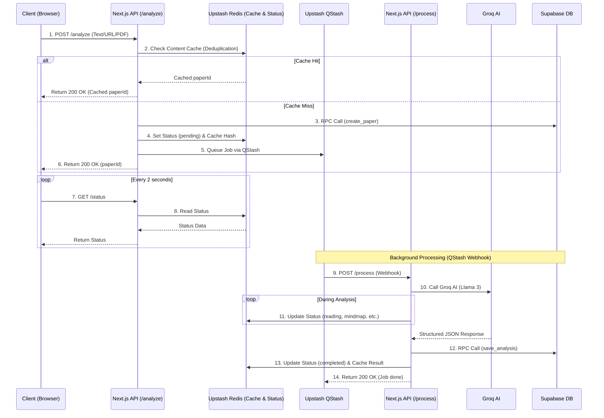

# PaperLens AI

PaperLens AI is a high-performance web application designed to help students, researchers, and engineers quickly comprehend complex academic papers. By pasting text, uploading a PDF, or providing a URL, users receive a structured, visually engaging explanation powered by Llama 3 via Groq. The application breaks down the research into a high-level summary, key concepts, mathematical explanations, interactive mind maps, and flashcard style learning aids, all wrapped in a premium, glassmorphic UI.

## Architecture



### Explanation of Each Layer

*   **Client (Browser)**: Built with Next.js App Router, React, Tailwind CSS, and Framer Motion. It handles PDF parsing entirely on the client side using pdf.js to save server bandwidth. It initiates the analysis and polls for updates.
*   **Next.js API Routes**: Acts as the backend orchestrator. It handles rate limiting, input validation, and triggers the asynchronous analysis task without holding the HTTP request open.
*   **Upstash Redis**: Serves as an ultra fast caching and state layer. It stores the exact status of the background analysis (e.g., "processing", "completed", "failed") so the frontend can poll it with single digit millisecond latency. It also handles rate limiting.
*   **Groq AI**: Provides the intelligence. We use Llama 3 70b to process the raw text and return a strictly typed JSON payload containing all the necessary educational breakdowns.
*   **Supabase PostgreSQL**: The persistent source of truth. All data access is strictly governed by Row Level Security and accessed exclusively through remote procedure calls (RPC) for maximum security.

## Why This Stack and Architecture

I chose this architecture to prioritize perceived performance, security, and developer experience. Academic papers are large, and LLM processing takes time (typically 10 to 30 seconds). A traditional synchronous API would timeout or leave the user staring at a frozen browser. By decoupling the request from the processing via Redis status polling, the frontend can render immediate, animated feedback. Next.js provides a unified environment to build both the frontend and these backend API routes.

Supabase was chosen for its strict Postgres security model. By disabling all direct table access via RLS and routing everything through RPCs, we eliminate the risk of malicious client side queries. Upstash Redis was selected because it is serverless, integrates perfectly into edge or serverless Next.js routes, and provides sub-millisecond response times for our aggressive 2 second polling interval.

## Full Folder Structure

```text
paperlensai/
├── src/
│   ├── app/
│   │   ├── api/v1/papers/
│   │   │   ├── analyze/route.ts
│   │   │   ├── [id]/route.ts
│   │   │   └── [id]/status/route.ts
│   │   ├── paper/[id]/
│   │   │   ├── page.tsx
│   │   │   ├── loading.tsx
│   │   │   └── error.tsx
│   │   ├── globals.css
│   │   ├── layout.tsx
│   │   └── page.tsx
│   ├── components/
│   │   ├── results/
│   │   │   ├── key-concepts.tsx
│   │   │   ├── learning-cards.tsx
│   │   │   ├── math-explained.tsx
│   │   │   ├── mind-map.tsx
│   │   │   ├── paper-preview.tsx
│   │   │   ├── related-topics.tsx
│   │   │   ├── results-page.tsx
│   │   │   └── summary-card.tsx
│   │   ├── ui/ (shadcn components)
│   │   ├── header.tsx
│   │   ├── paper-input.tsx
│   │   ├── processing-screen.tsx
│   │   └── theme-toggle.tsx
│   ├── hooks/
│   │   ├── use-analyze-paper.ts
│   │   ├── use-paper-results.ts
│   │   ├── use-paper-status.ts
│   │   └── use-pdf-parser.ts
│   ├── lib/
│   │   ├── ai/
│   │   │   ├── analyze.ts
│   │   │   └── prompt.ts
│   │   ├── supabase/
│   │   │   ├── client.ts
│   │   │   ├── middleware.ts
│   │   │   └── server.ts
│   │   ├── db.ts
│   │   ├── groq.ts
│   │   ├── ratelimit.ts
│   │   ├── redis.ts
│   │   ├── types.ts
│   │   └── utils.ts
├── supabase/
│   └── migrations/
│       ├── 00_create_papers_table.sql
│       ├── 01_create_analysis_results_table.sql
│       ├── 02_create_updated_at_trigger.sql
│       └── 03_create_rpc_functions.sql
├── public/
│   └── pdf.worker.min.mjs
├── .env.example
├── AGENTS.md
└── package.json
```

## Step-by-Step Local Setup (Frontend, Node.js API, Python Service, PostgreSQL)

*Note: This project consolidates the frontend and Node.js API into a single Next.js application using App Router API Routes. There is no separate Python service required for this architecture.*

1.  **Clone and Install**
    Clone the repository and install dependencies using pnpm.
    `pnpm install`

2.  **Supabase Setup (PostgreSQL)**
    Create a new Supabase project. Go to the SQL Editor and execute all the SQL files located in `supabase/migrations/` in sequential order (00 through 03). This will set up your tables, triggers, and RPC functions.

3.  **Upstash Setup (Redis & QStash)**
    Create a new Redis database in the Upstash console. Copy your REST URL and REST Token.
    Also, grab your QStash Token and URL from the Upstash console for background processing.

4.  **Groq Setup**
    Create an account on Groq and generate a new API key.

5.  **Environment Variables**
    Copy `.env.example` to `.env.local` and fill in the values:
    `cp .env.example .env.local`

6.  **Run the App**
    Start the development server.
    `pnpm dev`
    The application will be available at http://localhost:3000.

## .env.example Walkthrough

*   `NEXT_PUBLIC_SUPABASE_URL`: The unique URL of your Supabase project instance. Used by both client and server to locate your database.
*   `NEXT_PUBLIC_SUPABASE_PUBLISHABLE_KEY`: The public anon key for Supabase. Safe to expose to the browser.
*   `SUPABASE_SERVICE_ROLE_KEY`: A highly privileged secret key used by the Next.js server to bypass RLS when performing trusted administrative inserts (like saving the AI results). NEVER expose this to the browser.
*   `UPSTASH_REDIS_REST_URL`: The connection endpoint for your Upstash Redis instance.
*   `UPSTASH_REDIS_REST_TOKEN`: The authentication token allowing the server to read and write to Redis via HTTP.
*   `QSTASH_URL`: The Upstash QStash REST URL.
*   `QSTASH_TOKEN`: The Upstash QStash authentication token.
*   `GROQ_API_KEY`: Your secret key to access the Llama 3 models on Groq's high speed inference network.
*   `APP_URL`: Your deployed application URL (required for QStash webhooks to resolve).

## API Endpoints

### 1. Analyze Paper
**POST** `/api/v1/papers/analyze`
**Request:**
```json
{
  "inputType": "url",
  "url": "https://arxiv.org/abs/1706.03762",
  "title": "Attention Is All You Need"
}
```
**Response:**
```json
{
  "success": true,
  "data": {
    "paperId": "uuid-string-here",
    "status": "pending",
    "cached": false
  }
}
```

### 2. Process Analysis (QStash Webhook)
**POST** `/api/v1/papers/process`
**Request:**
```json
{
  "paperId": "uuid-string-here",
  "paperText": "Raw paper text...",
  "contentHash": "sha256-hash"
}
```
**Response:**
```json
{
  "success": true
}
```

### 3. Check Status
**GET** `/api/v1/papers/[id]/status`
**Request:** No body required.
**Response:**
```json
{
  "status": "processing",
  "current_step": "finding_ideas"
}
```

### 4. Get Results
**GET** `/api/v1/papers/[id]`
**Request:** No body required.
**Response:**
```json
{
  "paper": {
    "id": "uuid-string-here",
    "title": "Attention Is All You Need",
    "status": "completed"
  },
  "analysis": {
    "summary": {
      "title": "Attention Is All You Need",
      "category": "Machine Learning"
    }
  }
}
```

## The Exact AI Prompt Used

```text
You are PaperLens AI, an expert research paper analyst. Your job is to analyze academic papers and produce structured, beginner-friendly explanations.

You MUST respond with valid JSON matching the exact schema below. No markdown, no extra text: only JSON.

{
  "summary": {
    "title": "string: the paper title (extract from content or generate)",
    "category": "string: e.g. 'Machine Learning', 'Natural Language Processing', 'Computer Vision', 'Cryptography', 'Biology', etc.",
    "difficulty": "one of: 'Beginner', 'Intermediate', 'Advanced', 'Expert'",
    "one_line_summary": "string: one sentence explaining what the paper does",
    "problem_solved": "string: what problem does this paper address? (2-3 sentences, beginner-friendly)",
    "method_used": "string: what approach or method does the paper use? (2-3 sentences, beginner-friendly)"
  },
  "key_concepts": [
    {
      "name": "string: concept name e.g. 'Transformers'",
      "description": "string: one sentence explanation"
    }
  ],
  "math_explanation": {
    "has_math": "boolean: true if the paper contains significant mathematical content",
    "equation": "string or null: the most important equation in LaTeX notation, or null",
    "equation_name": "string or null: name of the equation e.g. 'Attention Score Formula'",
    "what_it_means": "string or null: plain English explanation of what this equation computes",
    "symbols": [
      { "symbol": "string: e.g. 'Q'", "meaning": "string: e.g. 'Query matrix'" }
    ],
    "step_by_step": ["string: each step explaining the equation in simple terms"],
    "simple_explanation": "string or null: a simple analogy or human-friendly explanation of the math"
  },
  "mind_map": {
    "root": {
      "id": "string",
      "label": "string: paper title or main topic",
      "children": [
        {
          "id": "string",
          "label": "string: sub-topic",
          "children": [
            { "id": "string", "label": "string: detail" }
          ]
        }
      ]
    }
  },
  "learning_cards": [
    {
      "question": "string: a useful question about the paper",
      "answer": "string: concise answer (2-3 sentences)",
      "icon": "string: one of: 'bulb', 'target', 'gear', 'rocket', 'book'"
    }
  ],
  "related_topics": [
    {
      "name": "string: topic name",
      "description": "string: one sentence about why this is relevant",
      "search_url": "string: Google Scholar search URL for this topic"
    }
  ]
}

RULES:
- key_concepts: provide 5-8 concepts
- mind_map: create a tree with 3-5 main branches, each with 2-3 leaves. Use short labels.
- learning_cards: provide exactly 5 cards covering: what problem, main idea, why it works, applications, what to learn next
- related_topics: provide 5-7 topics with valid Google Scholar URLs (https://scholar.google.com/scholar?q=...)
- math_explanation: if the paper has no significant math, set has_math to false and set equation, equation_name, what_it_means, simple_explanation to null, symbols to [], step_by_step to []
- All explanations should be beginner-friendly. Avoid jargon without explanation.
- IMPORTANT: Wrap ANY math symbols, variables, or short equations inside text fields (what_it_means, simple_explanation, step_by_step, meaning) with $ signs for inline formatting (e.g., "The factor $gamma$").
- The input text may contain Unicode superscripts (e.g. x², n⁺¹) and subscripts (e.g. x₁, aₙ) extracted from PDF rendering. Interpret these as mathematical notation and convert them to proper LaTeX in your output (e.g. x² → x^2, x₁ → x_1).
- Mind map node IDs must be unique strings (e.g. "root", "1", "1-1", "1-2", "2", "2-1")

Analyze the following research paper content and provide a structured explanation:

---
[PAPER TEXT HERE]
---

Respond with ONLY valid JSON matching the schema described in your instructions.
```

## How Async Processing Works

When a user submits a paper, the `/api/v1/papers/analyze` route receives the request. Instead of waiting for the AI to finish, the route inserts a new "pending" record into Postgres, writes an initial "received" status to Redis, and securely queues a webhook job using **Upstash QStash**. The route immediately responds to the client with a 200 OK and the generated `paperId`. 

QStash then asynchronously POSTs to the `/api/v1/papers/process` webhook route on the server. This route continues running, communicating with Groq, updating Redis with its current processing step (so the frontend sees progress), and finally saving the completed JSON directly to Postgres via a server-side RPC call.

## How the Frontend Detects Completion

The frontend utilizes a custom React hook called `usePaperStatus`. When the user is redirected to the `/paper/[id]` page, this hook begins polling the `/api/v1/papers/[id]/status` endpoint every 2000 milliseconds. This endpoint performs extremely fast reads directly from Upstash Redis. The frontend uses the returned status string to drive the progress animations. Once the polling returns a "completed" status, the hook stops polling, triggers an invalidation, and the UI transitions from the animated loading screen to the final Results dashboard.

## Known Bugs or Limitations

*   **Context Window Limits**: We currently truncate the raw paper text to roughly 12000 to 15000 characters before sending it to the LLM to avoid token limits and reduce inference time. Very long papers might lose nuance from their later sections.
*   **PDF Export Instability**: Exporting the analysis to a PDF can sometimes be unstable or crash due to issues with browser rendering tools handling modern CSS color functions.
*   **Export Cutoffs**: In the PDF export, wide or deep mind maps generated by React Flow are occasionally cut off because the export logic captures the visible viewport instead of the fully expanded canvas.
*   **PDF Parsing Complexities**: Complex multi-column PDFs or those with heavily stylized mathematical formulas can result in messy extracted text, slightly degrading the quality of the AI's analysis.

## What I Would Improve With More Time

*   Implement a robust, native PDF export solution that perfectly captures dynamic visualizations like the React Flow mind map without truncation or CSS parsing crashes.
*   Introduce vector database chunking (RAG) to allow the AI to read the entire paper rather than truncating it.
*   Add a conversational "Chat with this Paper" feature utilizing the saved context.
*   Support authentication so users can save a history of their analyzed papers to their account.

## Deployment Links

Live application: **[https://in-paperlensai.vercel.app](https://in-paperlensai.vercel.app)**
